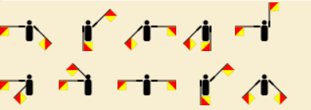

---
hide:
  - navigation
---

# Wat is JOTI?
JOTI, wat staat voor Jamboree On The Internet, is een superleuk evenement dat elk jaar in oktober plaatsvindt. Dit is dé kans voor scouts van over de hele wereld om via het internet met elkaar te chatten, samen te spelen en leuke opdrachten te doen! Tijdens JOTI leer je nieuwe vrienden kennen uit andere landen, ontdek je verschillende culturen en kun je samen met anderen de leukste uitdagingen aangaan.

## Wat is ScoutLink?
ScoutLink is een speciaal netwerk waar scouts met elkaar kunnen chatten. Het is een veilige plek waar je kunt praten met andere scouts, vragen kunt stellen en samen kunt werken aan verschillende opdrachten. Tijdens JOTI gebruiken wij mIRC om met het ScoutLink-netwerk te verbinden, een chatprogramma dat al sinds 1995 bestaat! 

Naast het klassieke mIRC zijn er ook moderne manieren om verbinding te maken met ScoutLink, zoals via apps op je telefoon of tablet. Hierdoor kunnen scouts op verschillende manieren contact met elkaar maken, afhankelijk van wat ze het leukst vinden! Maar jullie gaan mIRC gebruiken omdat dat nu op jullie computers staat geinstaleerd.

## Belangrijke regels!
- **Persoonlijke informatie**: Deel ***nooit*** je volledige naam, adres, telefoonnummer, gebruikersnamen van sociale media of andere persoonlijke informatie in de chat. Dit is belangrijk voor je eigen veiligheid. Gebruik alleen je voornaam of een scoutingnaam.
- **Gedragsregels**: We gebruiken ***geen*** ongepast taalgebruik of en gaan ook ***niet*** spam versturen. Dit kan er voorzorgen dat de hele scouting geblokeerd wordt het ScoutLink-netwerk. Ben dus beschaaft!
- **Vraag om hulp**: Als je ergens niet uitkomt of als iets niet goed werkt, vraag dan meteen de staf om hulp. Ze staan klaar om je te helpen met technische problemen of uitleg over mIRC.

## Hoe werkt mIRC?
mIRC is een programma waarmee je toegang krijgt tot verschillende chatrooms op het ScoutLink-netwerk. Het is de plek waar je andere scouts kunt ontmoeten en samen opdrachten kunt uitvoeren.

- **Verbinding maken met de server**: De staf zorgt ervoor dat mIRC automatisch verbinding maakt met de ScoutLink-server. Als de verbinding om wat voor reden dan ook wegvalt, roep dan meteen de staf erbij. Zij kunnen de server opnieuw instellen.
- **Chatrooms betreden**: Eenmaal verbonden met ScoutLink kun je verschillende chatrooms betreden. De belangrijkste kanalen zijn **#dutch** voor nederlandstalige chats en **#english** voor internationale chats in het Engels.
- **Privéberichten sturen**: Als je met een specifieke scout apart wilt chatten, kun je op hun naam in de chatroom klikken en hen een persoonlijk bericht sturen. Dit kan handig zijn als je samenwerkt aan een opdracht of vragen hebt.

## Opdrachten?
Alle opdrachten voor JOTI staan op deze website, gesorteerd per categorie. Je hebt verschillende soorten opdrachten zoals de vragenlijst, de Wikipedia-zoektocht, en de communicatie-uitdagingen. Probeer samen met andere scouts via de chatrooms de opdrachten zo goed mogelijk te voltooien. Het team dat de meeste punten verzamelt, wint!

Veel succes en plezier met het ontmoeten van scouts van over de hele wereld tijdens JOTI! Maak nieuwe vrienden, leer nieuwe dingen en vooral: geniet van deze geweldige ervaring! 🌍✨

### Opdracht: Internationale vragen?
Zoek een scout uit een land waarmee je wilt chatten. Vraag aan deze scout bij welke scouting hij zit en van welk land hij is. Hoe verder weg deze scout zich van jou bevindt hoe meer punten er beschikbaar komen. Schrijf deze locatie dus `scouting+land` goed op het antwoorden vel. Schrijf ook het antwoord van de vraag op, op het antwoord vel. Vraag dan maximaal 5 vragen aan deze scout. Probeer dus niet zo snel mogelijk door al je vragen heen te zijn want anders kom je zometeen een scout tegen die verder weg is en heb je dus punten laten liggen. 

1. **Wat is de meest populaire scoutingactiviteit in jouw land?**
2. **Wat is een typisch gerecht dat je tijdens scoutingkampen in jouw land eet?**
3. **Wat zijn de grootste uitdagingen waarmee scouts in jouw land te maken hebben?**
4. **Wat is een populaire traditie of festiviteit die scouts in jouw land vieren?**
5. **Hoe verschilt scouting in jouw land van scouting in Nederland?**
6. **Wat zijn de belangrijkste waarden die scouts in jouw land hooghouden?**
7. **Hoeveel scouts zijn er in jouw groep en wat maakt jullie uniek?**
8. **Wat is de grootste scoutingorganisatie in jouw land?**
9. **Welke unieke vaardigheden leren scouts in jouw land?**
10. **Wat is jouw favoriete manier om tijd in de natuur door te brengen als scout?**
11. **Wat zijn populaire buitenactiviteiten in jouw land die scouts vaak doen?**
12. **Hoe belangrijk is teamwork binnen jouw scoutsgroep?**
13. **Wat is een typisch scoutinguniform in jouw land?**
14. **Heb je een favoriete scoutingtechniek die je hebt geleerd?**
15. **Hoe vaak gaan jullie op kamp met je scoutsgroep?**
16. **Wat is de mooiste natuurervaring die je hebt gehad tijdens scouting?**
17. **Wat is een lokaal dier dat je vaak tegenkomt tijdens scoutingactiviteiten?**
18. **Welke spellen zijn populair in jouw scoutinggroep?**
19. **Wat zijn de meest gebruikte materialen in jouw scoutingactiviteiten?**
20. **Wat is iets wat je nog wilt leren binnen scouting?**
21. **Hoe heb je van JOTI gehoord en wat is je eerste indruk?**
22. **Wat hoop je te leren van scouts uit andere landen tijdens JOTI?**
23. **Hoe gebruik je technologie om contact te houden met andere scouts?**
24. **Wat vind je het leukste aan het chatten met scouts van over de wereld?**
25. **Heb je al met scouts uit andere landen gechat? Hoe was dat?**
26. **Wat is een activiteit of spel dat je zou willen organiseren tijdens JOTI?**
27. **Welke vaardigheden of kennis wil je delen met scouts uit andere landen?**
28. **Hoe vaak neem je deel aan internationale scoutingevenementen?**
29. **Wat zijn je verwachtingen van JOTI?**
30. **Wat vind je belangrijk in de verbinding met andere scouts via JOTI?**
31. **Hoe heeft JOTI je geholpen om meer over andere culturen te leren?**
32. **Wat zijn de grootste verschillen die je hebt opgemerkt tussen scouting in jouw land en scouting in Nederland?**
33. **Wat is een unieke activiteit die je zou willen delen met andere scouts tijdens JOTI?**
34. **Hoe belangrijk vind je het om verschillende talen te leren als scout?**
35. **Heb je al ideeën voor toekomstige projecten of activiteiten die je wilt doen met andere scouts?**
36. **Wat vind je het leukste aan het idee om wereldwijd vrienden te maken via scouting?**
37. **Heb je ooit iets bijzonders meegemaakt tijdens een online scoutingactiviteit?**
38. **Wat zou je andere scouts adviseren om het meeste uit JOTI te halen?**
39. **Wat is een typisch spel of activiteit die je graag tijdens JOTI zou willen spelen?**
40. **Wat is een belangrijk doel dat je wilt bereiken tijdens JOTI?**

### Opdracht: Wikipedia zoektocht?
Zoek de antwoorden op de vragen over scouting en communicatie op Wikipedia door gebruik te maken van relevante keywords. Typ een paar sleutelwoorden in de zoekbalk in plaats van de volledige vraag om een breder overzicht te krijgen. Lees de artikelen aandachtig en noteer de juiste antwoorden op je antwoordenvel. Vergeet niet om interessante feiten of extra informatie te verzamelen, want hoe meer details je hebt, hoe beter je je antwoorden kunt onderbouwen. Neem de tijd voor elke zoekopdracht, zodat je niets mist. Veel succes met je zoektocht!

1. **In welk jaar werd de Boy Scouts of America opgericht?**
2. **Wat is de betekenis van het woord "scouting"?**
3. **Wanneer werd de eerste World Scout Jamboree gehouden?**
4. **Wie is de oprichter van de wereldwijde scoutingbeweging, en wat was zijn bijdrage?**
5. **Wat komt er na `Sta paraat` in de afscheidsbrief van de oprichter van de scoutingbeweging?**
6. **Aan wat is de oprichter van scouting gestorven?**
7. **In welk jaar werd Morse-code ontwikkeld en door wie?**
8. **Wie is de uitvinder van de radio?**
9. **Wie heeft het eerste radiosignaal verzonden?**
10. **Wat is de rol van semaforen in de communicatie?**
11. **Wat is het doel van de Wereldscoutorganisatie (WOSM)?**
12. **In welk jaar werd de eerste editie van het handboek voor scouts gepubliceerd?**
13. **Wat zijn de kleuren van het scoutskostuum in Nederland?**
14. **In welk jaar vond de eerste Jamboree On The Internet (JOTI) plaats?**
15. **Wie heeft het scoutsgroet geïntroduceerd?**
16. **Wat is het doel van de Wereldscoutdag?**
17. **Hoe hete de eerste satelliet en wanneer werd deze gelanceerd?**
18. **Wat zijn de belangrijkste waarden van scouting?**
19. **In welk jaar werd de Internationale Federatie van Scoutingorganisaties (WAGGGS) opgericht?**
20. **Wie zijn enkele bekende scouts in de geschiedenis?**
21. **Wie zijn de oprichters van de eerste scoutsorganisatie in jouw land?**
22. **Wat is de rol van communicatie in noodsituaties?**
23. **In welk jaar werd het internet openbaar toegankelijk?**
24. **Wie was de eerste persoon die een mobiele telefoon uitvond?**
25. **Wat zijn enkele technieken die scouts gebruiken voor navigatie?**
26. **Wie is de huidige leider van de Wereldscoutorganisatie?**
27. **In welk jaar werd de eerste videogameconsole gelanceerd?**
28. **Wie was de uitvinder van de semafoorcommunicatie?**
29. **Wat is de betekenis van de term "outdoor education" in scouting?**
30. **In welk jaar werd de eerste versie van het internetprotocol (TCP/IP) geïmplementeerd?**
31. **Wie zijn de belangrijkste oprichters van scoutingorganisaties wereldwijd?**
32. **Wat zijn enkele communicatietools die scouts gebruiken tijdens JOTI?**
33. **In welk jaar werd de eerste postduif gebruikt voor communicatie?**
34. **Wie heeft de eerste succesvolle communicatiesatelliet ontworpen?**
35. **Wat zijn de verschillende manieren waarop scouts communiceren tijdens een kamp?**
36. **Welke rol speelt sociale media in de communicatie van scoutinggroepen?**
37. **Wat zijn de voordelen van het gebruik van digitale communicatie binnen scouting?**
38. **Hoe beïnvloedt technologie de manier waarop scouts met elkaar communiceren?**
39. **Wat zijn de belangrijkste principes van het Wereldhandvest van Scouting?**
40. **Wat zijn de verschillende speltakken binnen de scouting?**

### Opdracht: Communicatie zinnen?
In deze communicatie-opdrachten worden verschillende coderingstechnieken gebruikt. De deelnemers moeten de berichten decoderen die zijn weergegeven in Semaphore, Morse-code en ASCII. Elke opdracht vraagt om het ontcijferen van een specifieke boodschap, waardoor ze hun vaardigheden in het decoderen van verschillende communicatievormen kunnen testen.

1. **Wat staat hier in semaphoren uitgedrukt?**

2. **Wat staat hier in morsecode uitgedrukt?**
`.-- . .-.. -.-. --- -- . / ... -.-. --- ..- - ...`

3. **Wat staat hier in asii uitgedrukt?**
`72 101 108 108 111`

4. **Wat staat hier in asii uitgedrukt**
`67 111 100 101 32 108 101 97 114 110 105 110 103`

