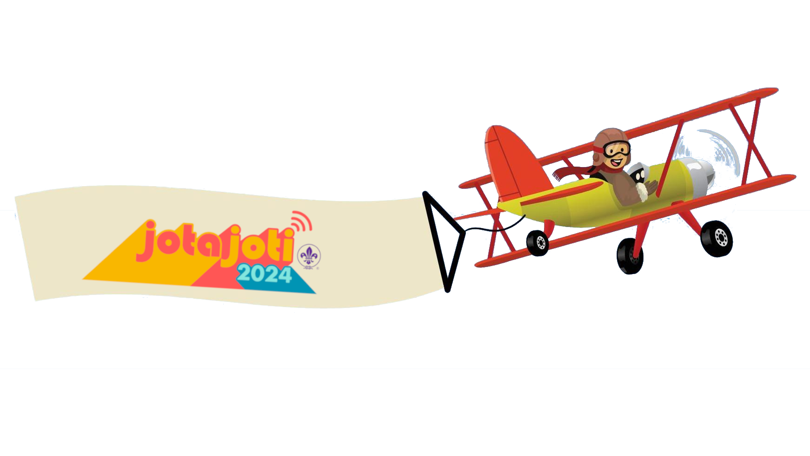

---
hide:
  - navigation
---

# Wat is JOTI?
JOTI, wat staat voor Jamboree On The Internet, is een superleuk evenement dat elk jaar in oktober plaatsvindt. Dit is dé kans voor scouts van over de hele wereld om via het internet met elkaar te chatten, samen te spelen en leuke opdrachten te doen! Tijdens JOTI leer je nieuwe vrienden kennen uit andere landen, ontdek je verschillende culturen en kun je samen met anderen de leukste uitdagingen aangaan.

## Wat is ScoutLink?
ScoutLink is een speciaal netwerk waar scouts met elkaar kunnen chatten. Het is een veilige plek waar je kunt praten met andere scouts, vragen kunt stellen en samen kunt werken aan verschillende opdrachten. Tijdens JOTI gebruiken wij mIRC om met het ScoutLink-netwerk te verbinden, een chatprogramma dat al sinds 1995 bestaat! 

Naast het klassieke mIRC zijn er ook moderne manieren om verbinding te maken met ScoutLink, zoals via apps op je telefoon of tablet. Hierdoor kunnen scouts op verschillende manieren contact met elkaar maken, afhankelijk van wat ze het leukst vinden! Maar jullie gaan mIRC gebruiken omdat dat nu op jullie computers staat geinstaleerd.

## Belangrijke regels!
- **Persoonlijke informatie**: Deel ***nooit*** je volledige naam, adres, telefoonnummer, gebruikersnamen van sociale media of andere persoonlijke informatie in de chat. Dit is belangrijk voor je eigen veiligheid. Gebruik alleen je voornaam of een scoutingnaam.
- **Gedragsregels**: We gebruiken ***geen*** ongepast taalgebruik of en gaan ook ***niet*** spam versturen. Dit kan er voorzorgen dat de hele scouting geblokeerd wordt het ScoutLink-netwerk. Ben dus beschaaft!
- **Vraag om hulp**: Als je ergens niet uitkomt of als iets niet goed werkt, vraag dan meteen de staf om hulp. Ze staan klaar om je te helpen met technische problemen of uitleg over mIRC.

## Hoe werkt mIRC?
mIRC is een programma waarmee je toegang krijgt tot verschillende chatrooms op het ScoutLink-netwerk. Het is de plek waar je andere scouts kunt ontmoeten en samen opdrachten kunt uitvoeren.

- **Verbinding maken met de server**: De staf zorgt ervoor dat mIRC automatisch verbinding maakt met de ScoutLink-server. Als de verbinding om wat voor reden dan ook wegvalt, roep dan meteen de staf erbij. Zij kunnen de server opnieuw instellen.
- **Chatrooms betreden**: Eenmaal verbonden met ScoutLink kun je verschillende chatrooms betreden. De belangrijkste kanalen zijn **#dutch** voor nederlandstalige chats en **#english** voor internationale chats in het Engels.
- **Privéberichten sturen**: Als je met een specifieke scout apart wilt chatten, kun je op hun naam in de chatroom klikken en hen een persoonlijk bericht sturen. Dit kan handig zijn als je samenwerkt aan een opdracht of vragen hebt.

## Opdrachten?
Alle opdrachten voor JOTI staan op deze website, gesorteerd per categorie. Je hebt verschillende soorten opdrachten zoals de vragenlijst, de Wikipedia-zoektocht, en de communicatie-uitdagingen. Probeer samen met andere scouts via de chatrooms de opdrachten zo goed mogelijk te voltooien. Het team dat de meeste punten verzamelt, wint!

Veel succes en plezier met het ontmoeten van scouts van over de hele wereld tijdens JOTI! Maak nieuwe vrienden, leer nieuwe dingen en vooral: geniet van deze geweldige ervaring! 🌍✨

